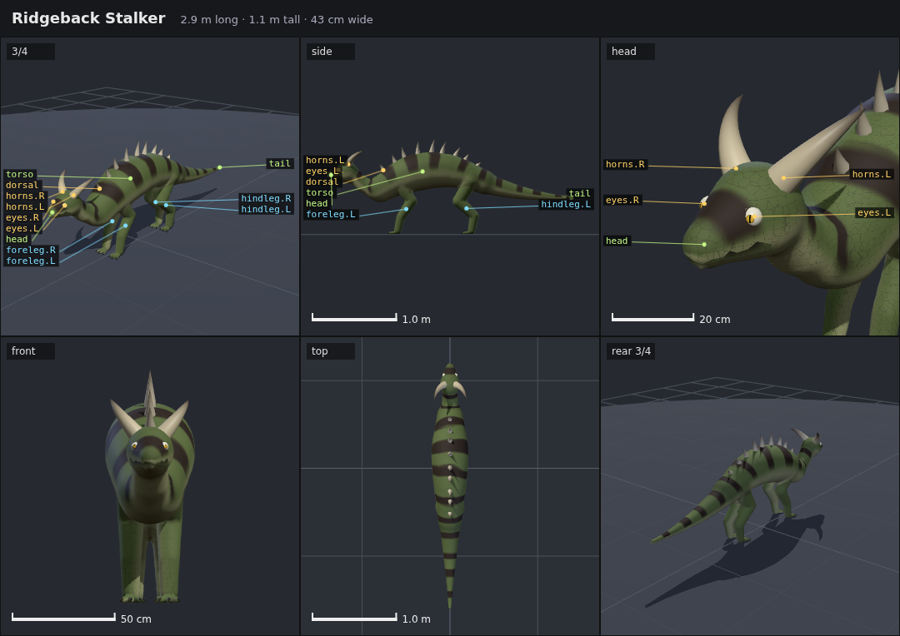

# Spawnforge

Procedural 3D monsters from short JSON blueprints. A blueprint (body plan, limbs, parts, skin,
behaviour) plus a seed becomes a finished creature: mesh, skeleton, textures and animation, all
made by code. The same blueprint and seed give the same monster every time.

- **Spore-style bodies.** A skeleton graph wrapped in a smooth signed-distance-field skin, with
  horns, claws, teeth and eyes as procedural meshes snapped onto it.
- **Computed animation.** Gaits come from whatever legs a creature has, feet are placed with
  inverse kinematics, and tails swing on springs.
- **Modular.** Every part, pattern, gait and action is one self-registering module file.
- **LLM-first.** A described schema, semantic attachment, structured errors, a CLI, an MCP server,
  and renders a model can look at to check its own work.

```json
{
  "format": "spawnforge/0.1",
  "name": "Ridgeback Stalker",
  "seed": 4127,
  "extends": "quadruped",
  "parts": [
    { "id": "horns", "type": "horn.curved", "attach": { "on": "head", "at": 0.75, "angle": 40 } }
  ]
}
```

The full example is [examples/ridgeback-stalker.json](examples/ridgeback-stalker.json).

## Status

Phases 0 and 1 are done: the blueprint format and its tools, then the pipeline that turns a
blueprint into a textured, skinned monster with a six-view render. On the 20-prompt eval a model
using only the docs and tools wrote a valid blueprint for every prompt, and a blind reviewer
matched all 20 renders to their prompts
([phase 0](eval/runs/2026-10-06-phase0-format/notes.md),
[phase 1](eval/runs/2026-10-06-phase1-render/notes.md)). Phase 2 (procedural locomotion) is in
progress; see [docs/plan.md](docs/plan.md) for the milestones.



## Getting started

Needs Node 22.18 or later and pnpm 10 (`corepack enable` selects the pinned version).

```sh
pnpm install
pnpm dev        # sandbox at http://localhost:5173
pnpm check      # lint, typecheck and tests
pnpm spawnforge validate examples/ridgeback-stalker.json
```

### Using it from an LLM

The MCP server exposes `list_modules`, `describe_module` and `validate`, plus the docs as
resources. With Claude Code:

```sh
claude mcp add spawnforge -- node packages/mcp/src/bin.ts
```

## Layout

```text
packages/
  core/      blueprint schema, registry, RNG, compile pipeline, motion, analysis (no DOM)
  three/     Three.js runtime: skinned mesh, TSL materials, pose sync, export
  modules/   first pack: body plans, parts, patterns, gaits, actions
  cli/       command line and headless renderer
  mcp/       MCP server over the CLI functions
apps/
  sandbox/   viewer, sliders, JSON panel, terrain test course, gallery
examples/    blueprints beside their renders (also the golden test set)
docs/        plan, architecture, blueprint format
```

## Docs

- [AGENTS.md](AGENTS.md): repo map, commands and rules, for agents and people
- [docs/plan.md](docs/plan.md): the design and milestones
- [docs/architecture.md](docs/architecture.md): layers, package boundaries and data flow
- [docs/blueprint.md](docs/blueprint.md): the blueprint format
- [docs/catalog.md](docs/catalog.md): every field and module (generated)
- [eval/](eval/README.md): the agent eval and its results
