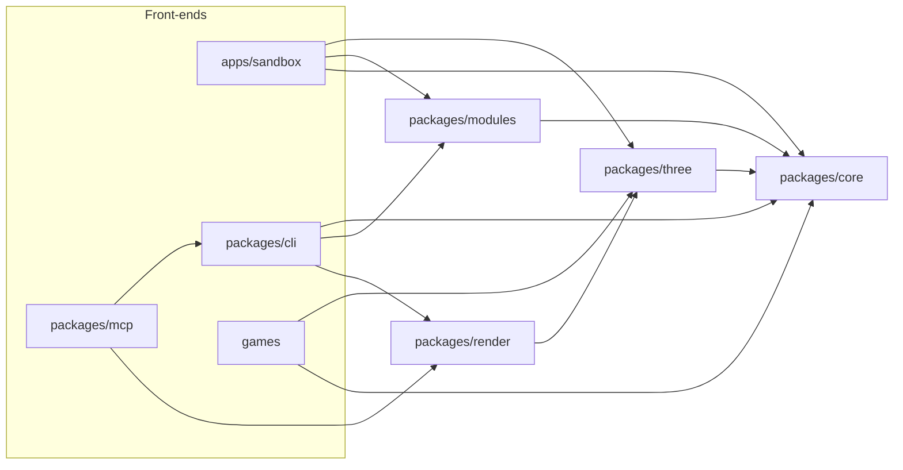

# Architecture

Data flows one way. A front-end edits a blueprint, a deterministic pipeline compiles it, and the
outputs (including renders and reports) flow back to whoever asked. The full reasoning is in
[plan.md](plan.md#architecture); this page is the short version for working in the code.

## Packages

| Package   | Owns                                                                                       | Runs in                         |
| --------- | ------------------------------------------------------------------------------------------ | ------------------------------- |
| `core`    | Blueprint schema, module registry, seeded RNG, compile pipeline, motion controller, analysis | Browser, Web Workers, Node      |
| `modules` | Module packs: body plans, parts, patterns, gaits, actions, themes                          | Browser, Web Workers, Node      |
| `three`   | Skinned mesh assembly, TSL materials, pose sync, glTF export                               | Browser (and headless Chromium) |
| `cli`     | Commands as plain functions returning JSON, plus the `spawnforge` binary                   | Node                            |
| `mcp`     | MCP tools wrapping the CLI functions                                                       | Node                            |
| `sandbox` | Live view and editing UI                                                                   | Browser                         |

## Principles

- **Core has no renderer or DOM.** It may use Three.js math classes. The package tsconfig leaves
  out the `dom` lib, so this is checked, not just agreed.
- **Stages are pure functions** of blueprint, seed and quality. Results are cacheable by hash,
  testable in isolation and replaceable one at a time.
- **Compiled output is plain data**: typed arrays and JSON, transferable out of workers and
  storable in a cache.
- **One renderer layer.** Only `three` touches the GPU. It builds materials from the material
  spec and copies poses from the motion controller into bones each frame.
- **One set of commands.** The CLI's command functions are the API for LLM tools; the MCP server
  only wraps them, so the two cannot drift.
- **The core never names a module.** What a blueprint gets when it leaves something out (the
  foot, the pattern layers, `generate`'s fallback body plan) comes from the packs' `defaults`;
  module-specific behaviour goes through hooks (`describe`, `normalize`, an action's `ambient`,
  a gait's `duty` per leg-pair count). A test greps the core for module ids.

## Pipeline

`compileCreature(spec, registry, { quality })` in `packages/core/src/compile` runs these stages,
each a pure function of the creature spec, seed and quality:

1. **Skeleton** (`skeleton.ts`). Torso, neck, head, jaw and tail become bone chains; standing
   height and body pitch come from where the legs need their hips. Several heads are one builder
   run per instance, each turned about the vertical and shifted across the chest after it is
   built, so the main head's bones never change; tails do the same at the rear, or fork from one
   trunk (`forkAt`). Instance bones carry their suffix after the section (`neck.L1.0`, `head.L1`,
   `jaw.L1`, `tail.R1.3`), and take their main counterpart's body coordinates. A neck that
   carries arms is an upright front (a centaur's human torso): it rises nearly straight from the
   torso's front in equal bones, carries a shoulder bar and pectoral masses, and hangs its arms
   from the chest's edge. Limbs are posed by the
   coupled-joint IK (`ik.ts`) so the feet rest on the ground, at the height each foot module (or
   the leg's stance) asks for; a sprawled leg longer than 0.7 torso lengths keeps the hip height
   of a 0.7 one and arches its knee above the hip (spiders). Then foot parts add toe chains. Knee, hock, elbow and jaw joints
   get helper bones.
2. **SDF** (`sdf.ts`). A rounded cone per bone (elliptical cross-sections allowed), plain union
   inside a chain, a smooth minimum once where a chain meets its parent. Bones thinner than about
   a grid cell are left out and become swept tubes later (a jaw stays in with its head). The head
   chain also carries its details (`head.ts`): lips, a brow over each eye and cheekbones as small
   masses, and nostrils as carves, the field's one subtraction. The grid leaves details out; the
   head's refinement shows them.
3. **Surface nets** (`surface-nets.ts`). A grid fitted to the creature (48, 96 or 128 cells along
   the longest axis), sampled only in blocks and sub-blocks near the surface, then light
   smoothing, a Newton step back onto the surface and normals from the field gradient.
4. **Skin weights** (`skin.ts`). Per vertex: the nearest bone, its parent and children only,
   softmax of radius-scaled distance, smoothed over the mesh, cut to the top four.
5. **Heads** (`head.ts`, `refine.ts`). Each head is refined toward its own edge length (a
   twelfth of the skull's radius at medium, within an allowance that keeps the skin under 30k
   triangles): long edges split, new vertices step onto the field with its details, and the
   triangles are evened out. Edges near a brow, cheekbone or nostril split once more.
6. **Mouth** (`mouth.ts`). The head is cut exactly along the mouth line (and around any chin
   the jaw makes): edges that cross it get a vertex on it, and those vertices are duplicated so
   the lower side follows the jaw; behind the corner the cheek blends from jaw to head. The
   inside is lofted from the cut's edge: each side's lip and gum strip runs on into a palate or
   a floor that closes at the throat, walls join them at the corners, and a tongue lies on the
   floor. Inside vertices carry their depth and kind for `shadeMouth`.
7. **Thin sections** become swept tubes skinned to their bones (toes, tail tips).
8. **Body coordinates**: along the spine, around the body, along the limb, crease depth and region
   weights per vertex. Textures read these instead of UVs. The lips' line reads as a crease.
9. **Parts** (`parts.ts`). Sockets march from a section's centreline to the skin; part modules
   build pieces in socket space and emit them with the socket's weights (teeth stand in the gums
   and follow the head or jaw, claws their toe, eyes get bones of their own). An eye that asks
   for lids gets two eyelid shells on bones of their own (`lids.ts`), joined to the skin with the
   nearest skin's coordinates, and a blink-driven chain. Parts report what they built
   (`measure`), which stats read.

The output is plain data (`CompiledCreature`): three meshes (skin, hard parts, eyes) sharing one
skeleton, the material spec, a rig description for motion, gameplay sockets, labelled markers
and stats. `@spawnforge/three` turns it into three `SkinnedMesh`es with TSL materials; the shader
for patterns is built from the same `Kit` functions the CPU uses (`packages/core/src/shading`).

### Shading

- **Materials.** Each base material is a surface drawn through the kit in `shadeSkin` (pores,
  hide's wrinkle network, overlapping scales, chitin's plates and seams), so bakes get it too,
  and a look in `MATERIAL_LOOK` (roughness, wrap, scatter tint, clearcoat). The skin material is
  a `MeshPhysicalNodeMaterial` whose lighting model adds wrapped diffuse light past the
  terminator, tinted by the scatter colour; chitin adds a clearcoat.
- **Layers** return a mask and optionally a colour, relief, roughness (over their own `coat`),
  glow (`emissive`) and a second colour laid first (`under`). `Surface.time` drives pulses: the
  pose's clock live (`Pose.time`, through `applyPose`), 0 in stills and bakes.
- **Fur** is a fourth skinned mesh sharing the skin's geometry, drawn as one instanced call of
  shells (12 at medium, 16 at high, none at low) pushed out along the skinned normal. Each
  fragment keeps or discards itself against a hair on a rest-space lattice; colours are the skin's
  stack, evaluated per vertex in the vertex stage. The skin under fur is darker and matte.
- **Parity.** `packages/render/src/parity.test.ts` draws the stack unlit in headless Chromium, one
  pixel per sampled skin vertex (three's `stackMaterial`), and compares it with `cpuKit` at the
  same vertices (`surfaceAt`): at least 99% of samples agree within 2/255, for every pattern on
  every material and for the examples.

Compilation runs in a Web Worker in the browser (`@spawnforge/three/worker`) and returns
transferable typed arrays.

## Motion

`MotionController` (`packages/core/src/motion`) animates a compiled creature from its rig and
`compiled.motion` (gait timing and temperament). It is pure math at a fixed 120 Hz step, so the
same code runs live in the browser, checks motion in Node and renders filmstrips.

- **Steering.** `moveTo`, `drive` and `stop` set a target and speed; turning rate and pace come
  from the temperament.
- **Gait.** Leg pairs are numbered from the back; leg phase is φ = (i·w + 0.5·s) mod 1 with the
  gait's wave offset w and duty factor. The gait is chosen by Froude number (walk to trot near
  0.5) unless `lockGait` pins one. Stride follows λ/h = 2.3·Fr^0.3, capped by how far each foot
  can travel within the leg's reach; past the cap, and when a planted foot would run out of reach
  (starting off, speeding up), the legs step faster instead of sliding.
- **Feet.** Planted feet stay fixed in the world. Swinging feet arc to a spot predicted half a
  stance ahead of the hip, on the ground the caller supplies (`update(dt, { ground })`). Legs
  with a stance roll (`roll.ts`): late in the stance the heel rises straight up while each toe's
  tip stays where it landed, solved as two-bone IK, and the toes let go early in the swing.
- **Body.** Height, pitch and roll follow the planted feet; the body sinks if a foot in a dip is
  out of reach. Bob and sway follow the steps, the spine bends into turns, sprawlers undulate.
  An upright front leans back against 80% of the body's pitch and rearing, so it stays upright
  on slopes, and twists about its own axis into turns.
- **Legless bodies** lay a trail behind a weaving head and place each spine joint along it, so
  the body follows its own path in S-curves. A rearing neck (a cobra) keeps its raised pose.
- **Actions** are modules (`hooks.goals` in an action module) that write body-relative goals
  each step: a point to look at, how far to lunge toward it, head raise and shake, jaw opening,
  crouch, rear, weight shift, breath, blink, tail swish and `arms` (raising the arms to reach
  for the look target, as `bite` does). Ambient actions (idle) run all the
  time; main actions (`act(id, { target })`) run one at a time on top and override the goals
  they set. Durations scale by √(hip height / 1 m). The core never names an action: it only
  applies goals, and it needs the module registry (`new MotionController(compiled,
  { registry })`) to run their code.
- **Layering per step:** goals; body (with crouch, rear and shift); heads (stabilised, glances,
  look target with the neck taking a share, raise, shake, lunge by cyclic coordinate descent on
  the neck; with several heads, the others replay the main head's glances after a seeded delay,
  and only the head nearest an action's target lunges); jaws; leg IK to the planted feet (so actions never make feet slide); arm swing (by the
  gait phase on bipeds; above four or more legs, following the opposite foreleg's foot) and the
  `arms` reach; tail
  springs pulling toward the rest shape (plus swish); helper bones.
- **Events**, returned by `update`: `footstep` (leg id and position), `gait` changes,
  `action-start` and `action-end`, and the moments actions declare (`bite-contact`,
  `roar-peak`) with the head's position (and, with several heads, which one in `head`).
- **Jaws and blinks** are bone turns (`applyFace`, shared with the render page's `--jaw` and
  `--blink`): every jaw about its hinge, every blink-driven chain toward its `closed` pose (turns
  about each bone's local X). **Breathing** travels with the pose as a number that `applyPose`
  feeds to the skin shader (the torso swells along its normals), and so does the clock
  (`Pose.time`) for pulsing patterns.

`applyPose` in `@spawnforge/three` copies the pose into the Three.js bones each frame. The
sandbox runs creatures on `testCourse` terrain; the render page's filmstrip mode walks one on
flat ground, draws a gait cycle and reports cycle time, stride, duty per leg and foot slide.

## Analysis and editing

- **`analyzeCreature`** (`packages/core/src/analysis`) compiles at low quality and measures:
  bounds, mass and centre of mass from the closed skin (water density), hip height, speeds per
  gait from their Froude ranges, bite reach, and balance (the centre of mass against the convex
  hull of the feet), and each gait's cadence (steps a second at its typical speed, from the
  controller's stride model). It then runs the motion controller for two gait cycles on flat and on rough
  `testCourse` ground and records the worst foot slide, ground penetration, overstretched legs
  (IK misses) and limb-limb or limb-body overlaps, each with the limb and time. Problems become
  warnings with id-based paths and fixes, next to the compile's own (`below_ground`,
  `leg_too_short`, `part_buried`). `describeCreature` writes a paragraph from the spec, using
  each module's optional `describe` hook, so the core never names a part.
- **`applyPatch`** (`packages/core/src/blueprint/patch.ts`) applies `set`, `add`, `remove`,
  `mirror` and `scale` by id-based paths, including into inherited preset items, then validates
  and returns a leaf-by-leaf diff. The CLI and MCP write the file back only when it is valid.
  `diffBlueprints` (`blueprint/diff.ts`) goes the other way: it compares two blueprints by the
  creatures they resolve to and returns the fewest operations that turn one into the other.
- **Migrations** (`blueprint/migrate.ts`, one step per file in `blueprint/migrations/`) upgrade an
  older blueprint before anything else reads it. Commands that write blueprints write the
  current format (`toCurrentFormat`), and the corpus test replays every saved blueprint.
- **Normalization** runs in two steps before validation: `normalizeBlueprint` rewrites the
  core's friendly forms (colour names, `{ "type": "walk" }`), then, after merging with the
  preset, `normalizeModules` runs each module's `normalize` hook on its own parameters.
- **`randomBlueprint`** draws blueprints from the JSON Schema and the module registry; the fuzz
  harness (`pnpm fuzz`, and a slice in the tests) compiles them.
- **`fingerprint`** hashes a compiled creature's quantized meshes and skeleton. The golden test
  pins the examples' hashes, and the render tests check that Chromium compiles to the same ones.

## Variation

All of it lives in `packages/core/src/variation` and works on blueprints, never on meshes, so
every result is an ordinary blueprint that validates, diffs and compiles like a hand-written one.

- **Species** (`species.ts`): `{ min, max }` ranges resolved by `instantiate` with one RNG stream
  per path; `validateSpecies` validates the all-minimum and all-maximum individuals and a few
  seeds.
- **Genes** (`genes.ts`): `expand` resolves a blueprint over its preset and defaults (module
  parameters inline, as blueprints write them), and `genesOf` lists every number, profile, enum,
  colour and switch with its range from the JSON Schema or the module's own schema. A changed,
  expanded child becomes patch operations on the parent's file (`opsBetween`), so the output keeps
  the parent's shape; `finish` applies them and drops parts, layers, gaits or actions that no
  longer fit (a bite without a jaw) instead of failing.
- **Mutate** (`mutate.ts`) draws each gene from a stream keyed by its path and the parent's seed;
  structural changes use part modules' `slot` and `tags`. **Crossbreed** (`crossbreed.ts`) pairs
  items, blends or picks genes and inherits unpaired items by chance.
- **Generate** (`generate.ts`) runs one grammar for every theme: body plan, shape, parts, layers,
  palette (HSL ranges with a lightness-contrast rule so patterns stay readable), material,
  temperament, name. A theme module (`defineTheme`, `bias: ThemeBias`) only supplies weights and
  species fragments. Constraints filter body plans by the features required actions need, force
  required parts, retry with the next attempt's stream, and meet height limits by rescaling,
  measured from the skeleton without meshing.

## Export and the game runtime

See [runtime.md](runtime.md) for how games use them.

- **Clips** (`packages/core/src/motion/clips.ts`): `bakeClips` runs the motion controller on
  flat ground and samples every bone's local transform: `idle`, one in-place cycle per gait
  (locked gait at its natural speed, timed between two phase wraps, at least 12 frames, the seam
  spread over the cycle so it loops exactly) and each action aimed in front of the head. Roots
  stay at the origin facing +Z. Plain typed arrays, like everything core produces.
- **Vertex colours** (`packages/core/src/export/bake.ts`): the skin's pattern stack evaluated
  per vertex through the CPU kit, the same pattern functions the TSL shader runs; parts and eyes
  convert their own colours. Linear, albedo only: relief and glow wait for texture maps (11.1).
- **Stats** (`packages/core/src/analysis/stats.ts`): `computeStats` gives a stats module a
  `StatsInput` of measured body numbers; modules never see the blueprint.
- **Export scene** (`packages/three/src/export.ts`): `buildExportScene` assembles the skeleton,
  three skinned meshes with vertex colours and plain `MeshStandardMaterial`s (chitin's skin a
  `MeshPhysicalMaterial` with its clearcoat), socket nodes, `AnimationClip`s and the extras, plus
  notes on what the file leaves out (fur, glow). The render page writes it with `GLTFExporter` in headless
  Chromium (`Renderer.export`), as the sandbox does in the browser.
- **Runtime** (`packages/three/src/runtime.ts`): `createBestiary` compiles through workers or on
  the calling thread with an LRU cache keyed by stable JSON, format and packs. A `Creature` wraps
  the Three.js object, a `MotionController`, sockets and events. Its baked level of detail steers
  with simple kinematics and samples baked gait cycles at the speed's rate, and hides fur; going back to full
  motion calls `MotionController.place`, which plants the feet around the creature's spot.

## Runtime conventions

- World units follow glTF: metres, Y up, creatures face +Z.
- Packages ship TypeScript source; Node runs it with type stripping, and Vite and Vitest load it
  directly. See [AGENTS.md](../AGENTS.md#how-the-code-runs).
- Rendering in tests and tools uses headless Chromium through Playwright on the WebGL 2 backend,
  so it works without a GPU.
