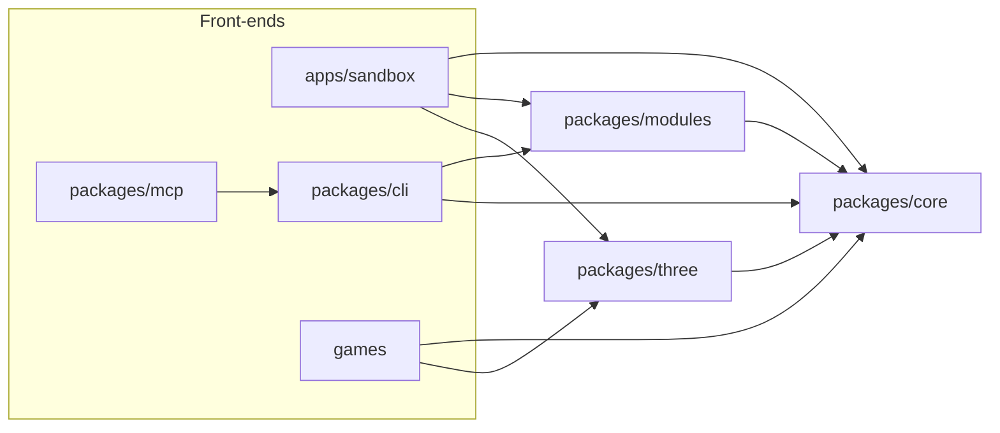

# Architecture

Data flows one way. A front-end edits a blueprint, a deterministic pipeline compiles it, and the
outputs (including renders and reports) flow back to whoever asked. The full reasoning is in
[plan.md](plan.md#architecture); this page is the short version for working in the code.

## Packages

| Package   | Owns                                                                                       | Runs in                         |
| --------- | ------------------------------------------------------------------------------------------ | ------------------------------- |
| `core`    | Blueprint schema, module registry, seeded RNG, compile pipeline, motion controller, analysis | Browser, Web Workers, Node      |
| `modules` | Module packs: body plans, parts, patterns, gaits, actions, themes                          | Browser, Web Workers, Node      |
| `three`   | Skinned mesh assembly, TSL materials, pose sync, glTF export                               | Browser (and headless Chromium) |
| `cli`     | Commands as plain functions returning JSON, plus the `spawnforge` binary                   | Node                            |
| `mcp`     | MCP tools wrapping the CLI functions                                                       | Node                            |
| `sandbox` | Live view and editing UI                                                                   | Browser                         |

## Principles

- **Core has no renderer or DOM.** It may use Three.js math classes. The package tsconfig leaves
  out the `dom` lib, so this is checked, not just agreed.
- **Stages are pure functions** of blueprint, seed and quality. Results are cacheable by hash,
  testable in isolation and replaceable one at a time.
- **Compiled output is plain data**: typed arrays and JSON, transferable out of workers and
  storable in a cache.
- **One renderer layer.** Only `three` touches the GPU. It builds materials from the material
  spec and copies poses from the motion controller into bones each frame.
- **One set of commands.** The CLI's command functions are the API for LLM tools; the MCP server
  only wraps them, so the two cannot drift.

## Pipeline

The compile stages are specified in the plan:

1. [Bodies and skin](plan.md#bodies-and-skin): body graph to skeleton, chains to SDF, SDF to mesh
   by surface nets, body coordinates, skin weights.
2. [Parts and textures](plan.md#parts-and-textures): sockets, the geometry kit, part meshes, and
   the TSL pattern stack.
3. [Procedural animation](plan.md#procedural-animation): leg discovery, posture, gaits, stepping,
   IK, springs and actions, run live by the motion controller.

Compilation runs in a Web Worker in the browser and returns transferable typed arrays.

## Runtime conventions

- World units follow glTF: metres, Y up, creatures face +Z.
- Packages ship TypeScript source; Node runs it with type stripping, and Vite and Vitest load it
  directly. See [AGENTS.md](../AGENTS.md#how-the-code-runs).
- Rendering in tests and tools uses headless Chromium through Playwright on the WebGL 2 backend,
  so it works without a GPU.
