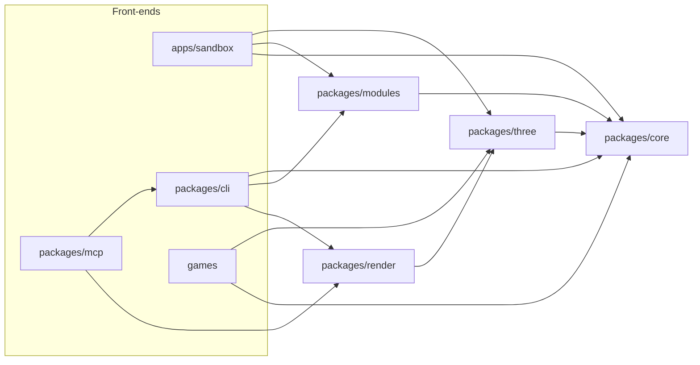

# Architecture

Data flows one way. A front-end edits a blueprint, a deterministic pipeline compiles it, and the
outputs (including renders and reports) flow back to whoever asked. The full reasoning is in
[plan.md](plan.md#architecture); this page is the short version for working in the code.

## Packages

| Package   | Owns                                                                                       | Runs in                         |
| --------- | ------------------------------------------------------------------------------------------ | ------------------------------- |
| `core`    | Blueprint schema, module registry, seeded RNG, compile pipeline, motion controller, analysis | Browser, Web Workers, Node      |
| `modules` | Module packs: body plans, parts, patterns, gaits, actions, themes                          | Browser, Web Workers, Node      |
| `three`   | Skinned mesh assembly, TSL materials, pose sync, glTF export                               | Browser (and headless Chromium) |
| `cli`     | Commands as plain functions returning JSON, plus the `spawnforge` binary                   | Node                            |
| `mcp`     | MCP tools wrapping the CLI functions                                                       | Node                            |
| `sandbox` | Live view and editing UI                                                                   | Browser                         |

## Principles

- **Core has no renderer or DOM.** It may use Three.js math classes. The package tsconfig leaves
  out the `dom` lib, so this is checked, not just agreed.
- **Stages are pure functions** of blueprint, seed and quality. Results are cacheable by hash,
  testable in isolation and replaceable one at a time.
- **Compiled output is plain data**: typed arrays and JSON, transferable out of workers and
  storable in a cache.
- **One renderer layer.** Only `three` touches the GPU. It builds materials from the material
  spec and copies poses from the motion controller into bones each frame.
- **One set of commands.** The CLI's command functions are the API for LLM tools; the MCP server
  only wraps them, so the two cannot drift.

## Pipeline

`compileCreature(spec, registry, { quality })` in `packages/core/src/compile` runs these stages,
each a pure function of the creature spec, seed and quality:

1. **Skeleton** (`skeleton.ts`). Torso, neck, head, jaw and tail become bone chains; standing
   height and body pitch come from where the legs need their hips. Limbs are posed by the
   coupled-joint IK (`ik.ts`) so the feet rest on the ground, then foot parts add toe chains.
   Knee, hock, elbow and jaw joints get helper bones.
2. **SDF** (`sdf.ts`). A rounded cone per bone (elliptical cross-sections allowed), plain union
   inside a chain, a smooth minimum once where a chain meets its parent. Bones thinner than about
   a grid cell are left out and become swept tubes later.
3. **Surface nets** (`surface-nets.ts`). A grid fitted to the creature (48, 96 or 128 cells along
   the longest axis), sampled only in blocks and sub-blocks near the surface, then light
   smoothing, a Newton step back onto the surface and normals from the field gradient.
4. **Skin weights** (`skin.ts`). Per vertex: the nearest bone, its parent and children only,
   softmax of radius-scaled distance, smoothed over the mesh, cut to the top four.
5. **Mouth** (`mouth.ts`). The closed head is cut along the mouth line; vertices on the cut are
   duplicated so the lower copies follow the jaw. An inner mouth sits inside.
6. **Thin sections** become swept tubes skinned to their bones (toes, tail tips).
7. **Body coordinates**: along the spine, around the body, along the limb, crease depth and region
   weights per vertex. Textures read these instead of UVs.
8. **Parts** (`parts.ts`). Sockets march from a section's centreline to the skin; part modules
   build pieces in socket space and emit them with the socket's weights (teeth follow the head
   or jaw, claws their toe, eyes get bones of their own).

The output is plain data (`CompiledCreature`): three meshes (skin, hard parts, eyes) sharing one
skeleton, the material spec, a rig description for motion, gameplay sockets, labelled markers
and stats. `@spawnforge/three` turns it into three `SkinnedMesh`es with TSL materials; the shader
for patterns is built from the same `Kit` functions the CPU uses (`packages/core/src/shading`).

Compilation runs in a Web Worker in the browser (`@spawnforge/three/worker`) and returns
transferable typed arrays.

## Runtime conventions

- World units follow glTF: metres, Y up, creatures face +Z.
- Packages ship TypeScript source; Node runs it with type stripping, and Vite and Vitest load it
  directly. See [AGENTS.md](../AGENTS.md#how-the-code-runs).
- Rendering in tests and tools uses headless Chromium through Playwright on the WebGL 2 backend,
  so it works without a GPU.
