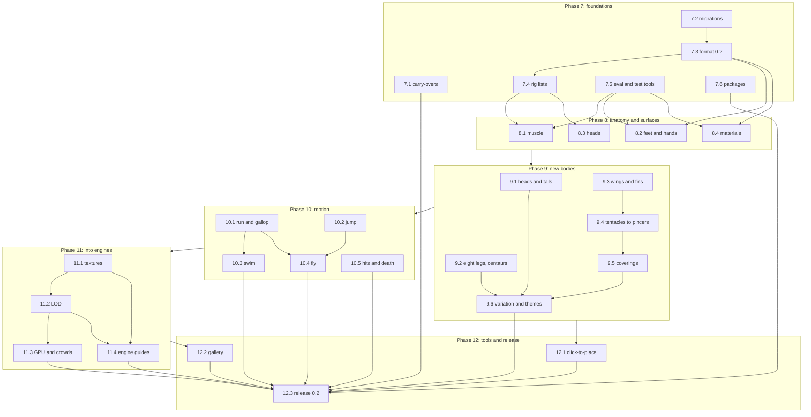

# Spawnforge plan 2: game-ready monsters

[Plan 1](plan.md) built the system and proved it: a short blueprint becomes a meshed, textured,
animated creature, and a model using only the docs and tools writes those blueprints reliably.
Plan 2 makes the creatures good enough to ship in a game. It brings believable anatomy and
surfaces, the bodies plan 1 deferred (wings, fins, tentacles, shells, extra heads) and the motion
games need (run, jump, swim, fly, hit reactions, death). It also adds exports with texture maps
and levels of detail, installable packages and editing tools. It continues plan 1's numbering
with phases 7 to 12.

> **Handoff.** This plan is written for an agent working at **xhigh** reasoning effort, without
> the conversation that produced it. Every milestone names the effort it needs: four are raised
> to **max**, fifteen are confirmed at xhigh and nine are lowered (see
> [Effort levels](#effort-levels)). Plan 1's rules in [AGENTS.md](../AGENTS.md) and
> [plan.md](plan.md) still hold unless this plan changes them explicitly.

## Starting point

### What exists

At the end of plan 1 (commit `d101c06`):

- **Packages.** `core` (blueprint schema, registry, RNG, compile pipeline, motion controller,
  analysis, variation, clip and colour bakes), `modules` (the basic pack), `three` (assembly, TSL
  materials, pose sync, export scene, runtime), `cli`, `mcp`, `render` (headless Chromium) and
  the sandbox. About 20k lines of TypeScript and 190 tests beside the code.
- **Basic pack.** Body plans `biped`, `quadruped`, `hexapod`, `serpent`; parts `ear.pointed`,
  `eye.basic`, `foot.claw`, `horn.curved`, `spikes.row`, `teeth.row`; patterns `countershade`,
  `grime`, `mottle`, `scales`, `spots`, `stripes`; gaits `walk`, `trot`, `tripod`, `slither`;
  actions `bite`, `roar`, `look`, `idle`; themes `reptile`, `insect`, `demon`; stats `rpg`.
- **Examples.** Four: `bog-troll`, `ember-beetle`, `reed-viper` and `ridgeback-stalker`, each a
  blueprint beside its render, with golden fingerprints.
- **Already in place for this plan.** Format migrations (`packages/core/src/blueprint/migrate.ts`
  chains steps before validation, warns `migrated`, and lists `KNOWN_FORMATS`); limbs may attach
  to the neck and tail as well as the torso; up to six leg pairs validate; `plate` exists in the
  geometry kit but no module uses it.
- **Measured** ([poc.md](poc.md)): compile 41–287 ms in Node and 71–372 ms in Chrome at medium
  quality; skin 4.0k–26.5k triangles; 3 draw calls; motion 0.037–0.076 ms per creature and
  2.76 ms for 50. GPU frame rate was not measurable (agent sandboxes render on the CPU).
- **Evals.** The 20-prompt suite (called suite A below) scored 20/20 valid and 20/20 blind matches
  at every gate; variation 8/8; export 4/4 ([eval/runs](../eval/runs)).

### What is missing

| Source | What it says |
| --- | --- |
| Blind reviews, every gate | Tube-and-stilt bodies without muscle or joints; generic feet (no hooves, paws or pads); teeth glued on and sparse; mouths not visibly cut; one plastic look for skin, hide and chitin; scales as a Voronoi mosaic; big glossy eyes; sparse spots; rod-like tails |
| Agents' feedback marked "Later" | A `diff` command; an underside view; a cadence check; suggestions across sibling fields; an aim direction for horns; fangs scaled to the head; per-speed gait settings; an S-curved neck; running bipeds; muscle masses and shaped limbs; cobra hoods; beetle wing cases |
| plan.md's "Later" column | Flyers, swimmers, eight legs, several heads, centaurs; branching tails; wings, fins, tentacles, mandibles; shells, armour plates, quills, antennae, frills, sails; scars, bioluminescence, slime, fur-like shells; run and gallop, jump, swim, fly, hit reactions, death; click-to-place parts, a gallery, game plug-ins; meshoptimizer and xatlas |
| The code | The core names a few basic-pack modules, against plan 1's rule: schema defaults `foot.claw` and `countershade`, `walk` in `motion/gaits.ts` and `blueprint/random.ts`, `idle` in `analysis/analyze.ts`, and `quadruped` in `variation/generate.ts` |
| Runtime and export | Not installable from a registry (TypeScript source in a private monorepo); exports carry vertex colours only (no texture maps, so no bump or varying roughness); one mesh detail per creature; GPU budget unmeasured |

## Goals

1. Creatures a blind reviewer clearly prefers over plan 1's, judged against a fixed rubric.
2. The deferred bodies, limbs, parts and textures, written as easily as plan 1's.
3. The motion games need: running and galloping, jumping, swimming, flying, hit reactions and
   death.
4. Exports that look the same in an engine as they do live, with texture maps and levels of
   detail, and a stated answer for each live effect glTF cannot carry.
5. Packages a game can install, and tools to edit and browse creatures.
6. Models stay as good at the format as in plan 1. Suite A stays at 18/20 or better, valid and
   matched blind. Suite B reaches 18/20 valid and 16/20 matched. The
   [gate thresholds](#gate-thresholds) set each gate's bar.

## Scope

This table is plan 2's contract, as plan 1's scope table was. New ideas go to the "Later" column.

| Area | Plan 2 | Later |
| --- | --- | --- |
| Body plans | `octopod` (eight legs), `centaur`, `wyvern` (wings as forelimbs) and `fish` | Different heads on one body, segmented bodies (caterpillars), colonies; a `bat` preset; necks of different lengths on one body; human faces; a balance check stride by stride (dynamic balance) |
| Body sections | Muscle masses, joints and body shape; an S-curved neck; several identical necks and heads; several or split tails | General body graphs |
| Limbs | Stance (plantigrade, digitigrade, unguligrade); wings (membrane, feathered, and insect wings with wing cases); fins and flippers; tentacles | Walking on tentacles, prehensile tails as limbs |
| Parts | Hooves, paws, pads, talons, hands, beaks, mandibles, pincers, antennae, shells, armour plates and bands, quills, frills, hoods, sails, dorsal and tail fins | Body feathers, manes and hair, worn gear; a stinger that continues the tail (with a venom bulb); several rows of teeth; a ring frill; stalked eyes as one part; fin tip colours; glowing eyes |
| Textures | Distinct skin, hide, scales and chitin; fur shells; scars, bioluminescence, slime, warts, veins, rosettes, bands | Wounds that appear in play, wetness from water; fur colour and length per region; solid tints for a region or a tip (a white tail tip); finer regions (neck, arms, legs, feet) |
| Animation | Gaits that change with speed; run, gallop, bound; jump and pounce; swimming; flight (flap, glide, hover, take off, land); hit reactions; death | Ragdolls and physics, climbing, burrowing, herd and flock behaviour; a slug's crawl; curling into a ball; a quadruped rearing to run on two legs; resting wing poses |
| Export and runtime | Buildable npm packages; texture maps from UV atlases; levels of detail; crowds; a GPU benchmark; engine guides | KTX2 texture compression, engine plug-ins, Three.js past r186 |
| Tools | `diff`, `migrate`, an underside view, cadence and sibling-field checks, scenario files for renders and analysis, click-to-place parts, a static gallery, quality and motion reviews in the evals | Submissions to a hosted gallery, an in-game editor for players |

## Decisions this plan takes

plan.md left some questions open. Plan 2 assumes the answers below; the owner can overturn any
of them before the phase it affects.

| Question | This plan assumes | If overturned |
| --- | --- | --- |
| Art direction | Stylized but believable: clean shapes and bold patterns over real anatomy (muscle, joints, feet) | Realism needs detail beyond procedural patterns, a plan of its own |
| Players editing monsters in a game | No. Editing is for developers and models (sandbox, CLI, MCP) | An in-game editor becomes its own phase |
| Target hardware | Desktop and laptop GPUs; `low` quality is the phone tier, but phones are not tested | Phones need their own budgets and devices to test on |
| Feathers | Flight feathers on wings only | Body feathers are a large part and texture project |
| Physics | None: the game supplies ground and water heights; no ragdolls | A physics adapter would be a new package |
| Name | Spawnforge | |

## Effort levels

| Level | Use it for |
| --- | --- |
| **max** | Choices that lock in a contract others build on (the format, the rig), and new algorithms judged mostly by eye, where a wrong turn means reworking later phases |
| **xhigh** | The default: features through existing seams, with tests or metrics as the oracle and room for design |
| **high** | Well-specified work with a clear oracle: small fixes, tooling, packaging, UI, tuning against renders |
| **medium** | Assembling finished pieces |

Each milestone's level, confirmed against the xhigh default. This table is also the tracker:
update its status column as milestones merge. "Gate 8" in the needs column means all of phase 8,
since anatomy comes before the new vocabulary.

| Milestone | Effort | Why this level | Needs | Status |
| --- | --- | --- | --- | --- |
| [7.1 Carry-overs](#71-carry-overs-and-tidying) | high (lowered) | Small, local fixes, each specified here and testable | | Done ([#10](https://github.com/michaelcrosato/Spawnforge/pull/10)) |
| [7.2 Migrations](#72-migrations-a-command-and-a-corpus-test) | high (lowered) | The migration chain exists; this adds a command, writers and a corpus test | | Done ([#11](https://github.com/michaelcrosato/Spawnforge/pull/11)) |
| [7.3 Format 0.2](#73-format-02-the-new-vocabulary-and-a-format-eval) | **max (raised)** | The format is the contract for models, saved files and phases 8–12 | 7.2 | Done ([#12](https://github.com/michaelcrosato/Spawnforge/pull/12)) |
| [7.4 Rig lists](#74-rig-lists-without-a-visible-change) | xhigh (confirmed) | A wide refactor, but unchanged goldens are a strict oracle | 7.3 | Done ([#13](https://github.com/michaelcrosato/Spawnforge/pull/13)) |
| [7.5 Eval and test tools](#75-eval-and-test-tools) | high (lowered) | Scripts and harnesses in the style of plan 1's, with clear outputs | | Done ([#14](https://github.com/michaelcrosato/Spawnforge/pull/14)) |
| [7.6 Buildable packages](#76-buildable-packages) | high (lowered) | Standard tooling; an install test is the oracle | | Done ([#15](https://github.com/michaelcrosato/Spawnforge/pull/15)) |
| [8.1 Muscle and body shape](#81-muscle-masses-joints-and-body-shape) | **max (raised)** | Changes every creature, judged by eye; the rules must fit every body | 7.4, 7.5 | Done ([#16](https://github.com/michaelcrosato/Spawnforge/pull/16)); quality bar amended |
| [8.2 Feet, hands, stance](#82-feet-hands-and-stance) | xhigh (confirmed) | Modules through existing seams, plus a contained rest-pose change | 7.3, 7.5 | Done ([#17](https://github.com/michaelcrosato/Spawnforge/pull/17)) |
| [8.3 Heads](#83-heads-mouths-teeth-eyes-and-beaks) | xhigh (confirmed), one max step | Mouth and eye code with renders as the oracle; how lids and lips are built is a max step | 7.4 | Done ([#18](https://github.com/michaelcrosato/Spawnforge/pull/18)) |
| [8.4 Materials and patterns](#84-materials-and-new-pattern-layers) | xhigh (confirmed) | Shader work with a new CPU–GPU parity test; fur is the risk | 7.3, 7.5 | Done ([#19](https://github.com/michaelcrosato/Spawnforge/pull/19)) |
| [9.1 Heads and tails](#91-several-heads-and-split-tails) | xhigh (confirmed) | Builds on 7.4's lists; per-head mouths and targeting are the work | Gate 8 | Done ([#21](https://github.com/michaelcrosato/Spawnforge/pull/21)); extra heads glance after the main one |
| [9.2 Eight legs, centaurs](#92-eight-legs-and-centaurs) | xhigh (confirmed) | Upright fronts and four leg pairs reach into posture and balance | Gate 8 | Done ([#23](https://github.com/michaelcrosato/Spawnforge/pull/23)) |
| [9.3 Wings and fins](#93-wings-fins-and-membranes) | **max (raised)** | New geometry and skinning across several bone chains, which flight depends on | Gate 8 | Done ([#24](https://github.com/michaelcrosato/Spawnforge/pull/24)); leathery wings fold to about 55% of their span |
| [9.4 Tentacles to pincers](#94-tentacles-antennae-mandibles-and-pincers) | xhigh (confirmed) | Parts with bones (designed in 7.3) are a new capability; tests are the oracle | 9.3 | Done ([#25](https://github.com/michaelcrosato/Spawnforge/pull/25)); tentacles reach by FABRIK, suckers are a pattern |
| [9.5 Coverings](#95-coverings-shells-plates-quills-frills-hoods-and-sails) | xhigh (confirmed) | A new placement slot and conforming geometry; the harness and budgets check it | 9.4 | Not started |
| [9.6 Variation and themes](#96-variation-themes-and-stats-for-the-new-vocabulary) | xhigh (confirmed) | Pairing heads and wings in crossbreeds and the new themes' grammar are unsettled | 9.1–9.5 | Not started |
| [10.1 Run and gallop](#101-gaits-that-change-with-speed-run-and-gallop) | xhigh (confirmed) | Generalizes gaits without moving old ones; motion metrics check it | Gate 9 | Not started |
| [10.2 Jump and pounce](#102-root-motion-in-actions-jump-and-pounce) | xhigh (confirmed) | A new root channel in the controller; landing error is measurable | Gate 9 | Not started |
| [10.3 Swimming](#103-swimming) | xhigh (confirmed) | A new medium, input and 3D steering on existing machinery | 10.1 | Not started |
| [10.4 Flight](#104-flight) | **max (raised)** | New locomotion and runtime API that must read as flight for any wing; judged by eye | 10.1, 10.2 | Not started |
| [10.5 Hits and death](#105-hit-reactions-and-death) | xhigh (confirmed) | Contained; penetration and stability are measurable | Gate 9 | Not started |
| [11.1 Texture maps](#111-texture-maps-from-uv-atlases) | xhigh (confirmed), one max step | Conventions made visible by a round-trip render and the glTF validator; what each live effect exports as is a max step | Gate 10 | Not started |
| [11.2 Levels of detail](#112-levels-of-detail) | high (lowered) | A mature library behind a clear interface | 11.1 | Not started |
| [11.3 GPU cost and crowds](#113-gpu-cost-and-crowds) | xhigh (confirmed) | New TSL skinning; performance only measurable on real hardware | 11.2 | Not started |
| [11.4 Engine guides](#114-engine-guides) | high (lowered) | Docs plus per-engine scripts and an import test: tooling, not design | 11.1, 11.2 | Not started |
| [12.1 Click-to-place](#121-click-to-place-editing) | high (lowered) | UI on existing seams, with a round-trip oracle | Gate 9 | Not started |
| [12.2 Gallery](#122-gallery) | medium (lowered) | Assembles finished pieces into a static site | Gate 11 | Not started |
| [12.3 Release 0.2](#123-release-02) | high (lowered) | Protocol reruns and docs over finished work | All | Not started |

**Rules for effort**

- Work each milestone at its level, and switch only between milestones (or for a max step).
- A design question this plan does not settle is a max step, even inside a lower milestone:
  decide it at max, add a dated **Decision** line to the milestone here, then go on at the
  milestone's level. 8.3 and 11.1 each name one such step up front.
- 11.1 rises to max as a whole if the round-trip render oracle cannot be built: without it,
  colour-space and tangent conventions can only be checked by reasoning.
- If you cannot change your own level, make up for it on max milestones and max steps: write the
  design down first (`docs/design/<milestone>.md`), have an independent subagent review it
  adversarially, answer the review, then build.
- Gate runs follow a fixed protocol: run them at high. Fixes for gate feedback take the level of
  the milestone they belong to.
- Low is not used for milestones; it suits one-off chores (regenerating, formatting).

## How to work

**Before starting**

- Read [AGENTS.md](../AGENTS.md), [plan.md](plan.md) (the design and its rules), this plan,
  [architecture.md](architecture.md), [blueprint.md](blueprint.md), [runtime.md](runtime.md) and
  [eval/README.md](../eval/README.md).
- `pnpm install && pnpm check` must pass on `main` before you change anything.
- Renders need Chromium (Playwright's, or the one in `$SPAWNFORGE_CHROMIUM`). Agent sandboxes and
  CI render on the CPU with SwiftShader: renders are slow there, and GPU timings mean nothing.

**Each milestone**

1. Set the milestone's effort level.
2. Read the files it names and their tests. Write tests first wherever an oracle exists (goldens,
   metrics, round trips).
3. Build it within the rules: pure pipeline stages, determinism (random streams keyed by ids),
   one module per file, a core that never names a module, errors written for a model.
4. Look at it: `render --labels`, `--views`, filmstrips, scenarios (7.5) and `analyze`. Put
   before-and-after images in the PR for anything visible.
5. Add the creatures a milestone names to `examples/` (blueprint, render, golden fingerprint).
   Node checks every example; keep the Chromium tests (Chrome goldens, visual regression) on a
   fixed subset so CI stays fast.
6. Run `pnpm generate` after module changes, then `pnpm format` and `pnpm check`.
7. Update the docs in the same PR: `blueprint.md` and its recipes, `runtime.md`, `architecture.md`,
   the generated catalogue, and `CHANGELOG.md` (from 7.6).
8. Open a draft PR, get CI green, mark it ready and merge it with a merge commit. The owner's
   standing rule: PRs are always approved, and merged once CI is green. Merging through the API
   needs the head's full 40-character SHA.
9. Mark the milestone done in the table above, with its PR, and record measured numbers.

**Each gate**

Follow [eval/README.md](../eval/README.md), as plan 1 did:

- Pin a git worktree at the commit under test. Give independent subagents only the docs and the
  CLI (no source code): four agents with five prompts each for suites A and B, two with five
  tasks each for suite M, and a separate blind reviewer.
- Record the eval model in `run.json` by family and alias, as plan 1's runs do, with the date.
  An alias can move to a newer model between gates, so where your environment lets you record
  the exact version, do; and compare runs only when they used the same model.
- Score with the scripts, never with the agents' own account of their work.
- Write `notes.md` with a feedback → disposition table: each item fixed in the gate PR,
  documented, or moved to the "Later" column. None is dropped.

**Versions, goldens and looks**

- The format becomes `spawnforge/0.2` in milestone 7.3. It stays open until 12.3 freezes it: until
  then, additions go in. No value a blueprint can write changes meaning in plan 2: new behaviour
  comes as new fields, modules and defaults, so files saved as 0.1 or early 0.2 stay correct. A
  milestone that must change a meaning bumps the format and adds a step that runs on 0.2 files.
  After 12.3, any schema change bumps the format and adds a migration.
- In 0.x the pipeline may change how a blueprint looks. A milestone that moves vertices re-records
  the golden fingerprints once (`UPDATE_GOLDEN=1 pnpm test`), re-renders the examples
  (`pnpm render:examples`) and says why in the commit and the changelog.
- Refactors (7.4) must leave the goldens identical: that is their test.
- The RNG golden values in `rng.test.ts` do not change in plan 2.

**Lessons from plan 1**

- Format first, then build. Phase 0's format eval made the later phases smooth; 7.3 repeats it.
- Agents edit with `patch` far more than by hand, and check with renders and `analyze` more than
  with the docs. Every new list needs `[id=…]` paths, and every new feature a render view or
  label and an `analyze` check.
- Keep the core module-agnostic. A plan 1 bug came from the core naming the `idle` action, and a
  few names remain (7.1 removes them); capabilities go through hooks.
- Visual critique repeats until it is fixed. That is why anatomy (phase 8) comes before the new
  vocabulary, which inherits it.
- Biome also formats the JSON under `eval/runs`: run `pnpm format` before committing eval files.
  Eval renders are not committed (`.gitignore`); they are regenerated from the saved blueprints.

## Cross-cutting design

### Format 0.2

Milestone 7.3 designs everything plan 2 adds to the format at once, so it stays one coherent
language. It does not have to follow the starting proposal in its section; it does have to pass
the format eval.

**Stub modules.** Module ids are checked against the registry, so vocabulary that a later
milestone builds as modules (new feet, gaits, parts, patterns) enters 7.3 as stub modules. A
stub is the real module file with its id, parameters, docs and example but no build hooks.
Compile skips a module without hooks and warns `not_built`, naming the milestone. The core never
names the stubs.

### Locomotion media

Ground, water and air become core concepts, as limb roles are: the controller gets one mode per
medium (10.3 adds water, 10.4 air). Gait modules declare the medium they serve and supply their
timing and goals, so the core never names `fly` or `swim.paddle`. `generate --requires` takes
media and features (`water`, `air`), not module ids.

### A new package for export processing

`@spawnforge/bake` (`packages/bake`) holds the heavy, export-time and load-time mesh work: UV
atlases and texture bakes (11.1) and level-of-detail chains (11.2). It depends on `core` and on
WASM builds of xatlas, meshoptimizer and MikkTSpace (Three.js's `computeMikkTSpaceTangents` needs
an external MikkTSpace module). plan.md's stack foresaw the first two. Core keeps only `zod` and
Three.js math, and the live runtime loads `bake` only for LODs. Add it to AGENTS.md's repo map
when it lands.

### Runtime API additions

| Call or event | Milestone | Notes |
| --- | --- | --- |
| Sockets `head.<id>`, `mouth.<id>` | 7.4, 9.1 | The first head keeps `head` and `mouth` |
| `act('jump' \| 'pounce', { target })`; events `takeoff`, `land` | 10.2 | Actions may move the root |
| `update(dt, { ground, water, camera })` | 10.3 | `water(x, z)` returns `{ surface }` or `null` |
| `moveTo({ x, y, z }, { speed })`, `fly()`, `land()`; event `flap` | 10.4 | `y` for flyers and divers; 10.4 settles the API |
| `hit({ direction, bone, strength })`, `die({ direction })`; events `hit`, `death` | 10.5 | No physics engine |

### Eval suites

| Suite | What | From |
| --- | --- | --- |
| A (`eval/prompts.json`) | Plan 1's 20 prompts | Plan 1 |
| B (`eval/prompts-b.json`) | 20 prompts that need the new vocabulary, each with `expects` (feature predicates) | 7.3 (format only), gate 9 (full) |
| M (`eval/prompts-m.json`) | 10 motion tasks, each a scenario with checks | Gate 10 |
| Quality review | The same blueprints rendered by two commits, side by side, judged on a rubric | Gate 8 |
| Variation, export | Plan 1's tasks plus new ones | Gates 9 and 11 |

Suite B draft (7.3 finalizes the wording and the `expects`):

| Id | Prompt idea | Exercises |
| --- | --- | --- |
| b01-dragon | Four-legged dragon with bat wings, horns and a spiked tail | Wings, scales |
| b02-wyvern | Two legs; the wings are its arms; a stinger on the tail | Wings as arms |
| b03-giant-bat | Furry bat with big ears and membrane wings | Fur, membranes |
| b04-hydra | Heavy four-legged body with five long necks and heads | Several heads |
| b05-cerberus | Three-headed hound | Several heads, paws |
| b06-kraken | Bulbous body, eight tentacles, huge eyes | Tentacles, swimming |
| b07-reef-shark | Dorsal and pectoral fins, tall tail fin, rows of teeth | Fins, swimming |
| b08-cave-spider | Eight legs, fangs, bulbous abdomen | Eight legs, mandibles |
| b09-scorpion-king | Pincers, curled stinger, armoured body | Pincers |
| b10-centaur | Horse-like body with hooves, upright torso with arms, horned head | Centaur, hooves |
| b11-sea-turtle | Domed shell and flippers | Shell, fins |
| b12-quillback-boar | Quills down the back, old scars, tusks, hooves | Quills, scars |
| b13-frilled-lizard | A neck frill that opens | Frill |
| b14-stegosaur | Alternating plates on the back, tail spikes | Plates |
| b15-sail-back | A sail along the spine | Sail |
| b16-giant-moth | Feathery antennae, four broad wings, fur | Insect wings, antennae |
| b17-two-tailed-fox | Fur, paws, two tails | Split tails |
| b18-griffin | Eagle head with a beak, feathered wings, talons in front, a lion's body | Beak, feathered wings, talons |
| b19-armoured-burrower | Armadillo-like bands, digging claws | Armour bands |
| b20-glow-slug | Slime, glowing spots, eyes on stalks | Slime, bioluminescence |

Suite M draft (gate 10 finalizes it): a horse galloping at 12 m/s; a raptor running at 8 m/s; a
big cat pouncing on a target 4 m ahead; a shark cruising and turning; a crocodile walking into a
lake and swimming across; a dragon taking off, circling, gliding and landing on a slope; a moth
hovering; a hydra biting a target on its left with the nearest head; a bear hit from the left
that staggers and later dies; a sea turtle diving to 3 m and surfacing. Each runs as a scenario
(7.5) through `render` and `analyze`, so agents need only the CLI.

### Gate thresholds

"Valid" is within three fix rounds. "Re-score" validates the saved attempts at the new commit
without a new agent run.

| Gate | Suite A | Suite B | Also |
| --- | --- | --- | --- |
| 7 | Re-score after migration: 20/20 | Format eval: ≥ 18/20 valid, ≥ 18/20 meet `expects` | Corpus migrates; smoke test passes |
| 8 | Full run: ≥ 18/20 valid, ≥ 18/20 matched | Re-score: ≥ 18/20 | Quality review: new preferred in ≥ 16/20 pairs; budgets |
| 9 | Full run: ≥ 18/20 valid, ≥ 18/20 matched | Full run: ≥ 18/20 valid, ≥ 18/20 meet `expects`, ≥ 16/20 matched | Variation 12/12; fuzz; budgets |
| 10 | Re-score | Re-score | Suite M: ≥ 9/10 pass their checks, ≥ 8/10 filmstrips matched; motion budgets |
| 11 | Re-score | Re-score | Export eval passes; round trip and validator clean |
| 12 | Full run, as gate 9 | Full run, as gate 9 | Every other eval passes again |

### Budgets

| Budget | Target | Checked |
| --- | --- | --- |
| Compile time, medium, in a worker (Chrome) | ≤ 500 ms for every example; fuzz median ≤ 400 ms | Every gate |
| Skin mesh, medium | ≤ 30k triangles | Every gate |
| Hard parts, medium | ≤ 20k triangles | From phase 9 |
| Draw calls per creature | ≤ 3, plus one with fur and one with wing or fin membranes | Every gate |
| Motion update per creature | ≤ 0.1 ms walking, ≤ 0.15 ms flying or swimming; 50 mixed ≤ 5 ms | Every gate |
| 50 animated creatures at 60 fps, mid-range laptop | Measured by the owner with `pnpm bench` | 11.3 |
| 500 distant creatures at 60 fps | Measured by the owner with `pnpm bench` | 11.3 |
| Exported `.glb` with textures, medium | ≤ 8 MB, baked in ≤ 10 s | 11.1 |

If compile time breaks its budget, profile first. Moving hot loops to WASM or WebGPU compute is
allowed only with measurements that show the need, as plan.md's risk table says.

## Phase 7: Foundations

Plan 2 settles the format and the rig before building on them, and gets the eval tools and the
packaging ready, so later phases spend their effort on creatures.

### 7.1 Carry-overs and tidying

**Effort: high (lowered).** Small, local changes, each specified here and testable.

- **`diff a.json b.json`** (CLI and MCP): the patch operations that turn one blueprint into the
  other, by id-based paths, with one line per change. Reuse `opsBetween`
  (`packages/core/src/variation/genes.ts`) and the patch diff.
- **Underside view**: `render --views underside`, outside the default six, to check bellies.
- **Cadence check**: `analyze` reports steps per second for each gait and warns `fast_cadence`
  above 8 steps a second at the gait's natural speed, where it reads as jitter at 30 fps.
  Cadence follows hip height, so phase 4's agent found longer legs barely helped. Each fix the
  warning offers (such as a larger `scale`, or keeping it for a creature meant to be tiny) needs
  a test that applies it and sees the warning go.
- **Sibling-field suggestions**: an enum value that is wrong for its field but right for a
  sibling names that field in the fix (`body.head.shape: "wide"` → "`wide` is a `crossSection`").
- **Horn aim**: an optional `aim` for `horn.curved` (`forward`, `up`, `out`, `back`, `down`) that
  sets lean and turn, so forward mandibles and swept-back horns take one word. It is normalized
  by a new optional module hook, `normalize(params)`, which `blueprint/normalize.ts` calls, so the
  core still never names `horn.curved`.
- **The core stops naming modules**: the default foot and pattern layer come from the pack
  (`definePack` gains defaults), the biped walk's longer duty moves into the `walk` module, and
  `analyze`, `random` and `generate` use hooks (`ambient`) or pack defaults instead of `idle`,
  `walk` and `quadruped`.

**Done when** each change has tests and docs (blueprint.md, CLI help, MCP descriptions), the
goldens are unchanged, and the core names no module. The baked `idle` clip may keep its name:
it names the ambient motion it holds, not the action module.

**Decision (2026-10-06).** `aim` is solved when the horn is built, from the socket's real frame,
not in `normalize`: before the body is built the frame is unknown, and a level-section guess
missed badly on the jaw. `aim` replaces `lean` and `turn`, and the horn's `normalize` hook drops
them. Cadence counts one step per foot per cycle, as the agents' feedback did; the second fix
for a creature meant to be tiny is a `skittish` temperament, since its legs cannot reach far
enough for longer strides.

### 7.2 Migrations: a command and a corpus test

**Effort: high (lowered).** The chain already exists (`packages/core/src/blueprint/migrate.ts`
runs ordered steps before validation, warns `migrated` and lists `KNOWN_FORMATS`; the runtime's
cache key and `.glb` extras already carry the format). This milestone finishes it.

- Steps move to one file each in `packages/core/src/blueprint/migrations/`; `bestiary/0.1` →
  `spawnforge/0.1` is the first.
- `spawnforge migrate <file>` (CLI and MCP) writes the migrated blueprint back. `patch`,
  `mutate`, `crossbreed` and `instantiate` write the newest format; species validate through the
  chain.
- **Corpus test**: every blueprint saved under `eval/runs/` and `examples/` migrates. Those that
  were valid stay valid, and the invalid ones fail at the same paths. Each later migration
  re-runs it.

**Done when** the corpus test passes, the goldens are unchanged, and blueprint.md's "Format
versions" explains `migrate`. 7.3 makes the first real bump.

**Measured (2026-10-06).** The corpus is the 291 committed blueprints and species (4 examples,
287 saved under `eval/runs`; scratch folders are ignored); 289 are valid, and the other two fail
at `body.head.shape` ("wide", a `crossSection`). The test also relabels every 0.1 file
`bestiary/0.1` to run the whole chain.

### 7.3 Format 0.2: the new vocabulary and a format eval

**Effort: max (raised).** The format is the contract every model, saved creature and later phase
depends on. It has to stay easy to write while covering a dozen new body ideas, and a poor
choice costs a migration and rework in phases 8 to 12.

Decide once how a blueprint says everything plan 2 adds, and prove models can write it before
anything is built on it, as plan 1's phase 0 did. The design must cover:

- several necks and heads, and several or split tails;
- wings (membrane, feathered, insect wings and wing cases), fins and flippers, and tentacles;
- centaur-style bodies;
- stance, muscle and an S-curved neck;
- the new feet and hands, beaks, lips and tongues;
- coverings over a region of skin, shells, frills, hoods, sails, and dorsal and tail fins;
- antennae, mandibles and pincers;
- hide, fur and its length, and the new pattern layers;
- flying and swimming, and how a blueprint opts in or out.

Starting proposal, which the design may change and the format eval decides:

| Need | Proposed form |
| --- | --- |
| Several identical heads | `body.neck.count` (1–9) and `spread` (degrees): the necks fan out from the shoulders, each with a head shaped like the first and the same head parts |
| Several or split tails | `body.tail.count`, `spread`, and `split` (0–1, where along the tail the copies branch) |
| Wings, fins, tentacles | New limb roles `wing`, `fin` and `tentacle`. Wings and fins carry a `membrane` module (`membrane.bat`, `membrane.insect`, `wing.feathered`, `fin.rayed`) the way legs carry `foot`; tentacles allow up to 16 segments and no foot |
| Centaur-style bodies | Arms on an upright neck shaped like a torso (limbs may already attach to the neck), packaged as a `centaur` body plan |
| Stance | `limbs[].stance`: plantigrade, digitigrade or unguligrade; foot modules suggest one |
| Muscle and neck | `body.muscle` (0–1) with `limbs[].muscle` overrides; `neck.curve` for an S-shaped neck |
| Coverings | A new part slot, `region`: `attach: { "on": "torso", "region": "back" }` plus a `density`, scattered over the skin (quills, scutes, plates) |
| Fins, sails, frills, hoods, shells | Parts: `fin.dorsal` and `sail` in the row slot, `fin.tail`, `frill` and `hood` in the surface slot, `shell` over the torso |
| Fur | `skin.material: "fur"` with `skin.fur: { "length", "density" }` |
| Flying and swimming | Gait modules for water and air (`swim.undulate`, `swim.paddle`, `swim.flap`, `fly`, `glide`, `hover`) that apply by default when the body allows, as gaits do now |

Deliverables:

- Schema, normalization (friendly forms to canonical ones, in their own step) and validation,
  with id-based errors and fixes for every new field; `patch` paths (`[id=…]`, `[type=…]`) into
  every new list; the catalogue and JSON Schema regenerated.
- Stub modules (see [Format 0.2](#format-02)) for every new module id, so the vocabulary
  validates before it is built.
- `format` becomes `spawnforge/0.2`, with a 0.1 → 0.2 migration.
- Until a feature's milestone lands, `compile` warns `not_built`, naming the milestone, and
  blueprint.md marks the feature "from phase N".
- blueprint.md sections and recipes for everything new.
- Suite B (`eval/prompts-b.json`), with `expects` per prompt: feature predicates such as "a limb
  with role `wing`" or "`neck.count` ≥ 3", checked by `eval/score.ts` beside validity.
- A rig sketch for 7.4 and phase 9 (`docs/design/rig.md`): how heads, tails and the new limb roles
  appear in `Rig`; how a part module declares bones and springs (antennae, mandibles, frills,
  eyelids); how gait modules declare their medium; and which readers change.
- The format eval: suite B with the docs and `validate` only, since renders cannot show features
  that are not built yet.

**Done when** gate 7's thresholds are met and every feedback item has a disposition in the run's
notes.

### 7.4 Rig lists without a visible change

**Effort: xhigh (confirmed).** The refactor is wide, but it follows 7.3's rig sketch, and
unchanged goldens make a strict oracle.

The compiled rig, and everything that reads it, handles lists of heads and tails and has room for
wings, fins, tentacles and parts with bones, before any of them exist.

- `Rig.head`, `neck`, `jaw` and `tail` (`packages/core/src/compile/types.ts`) become `heads[]`
  (each with its neck bones, head, jaw, eyes and mouth line) and `tails[]`. Spring chains become
  one list; today only the tail has one, and antennae and tentacles join it in phase 9.
- Readers move to the lists: the mouth cut and mouth-slot parts, the motion controller (look,
  glances, jaw, tail springs), actions (goals apply to every head; a target picks the nearest
  head), analysis (bite reach per head), clips, export, the runtime's sockets, and stats input.
- Random streams stay keyed by ids, so the first head and tail draw exactly what they draw now.

**Done when** the golden fingerprints, the motion tests' results and the render tests' images
are unchanged, and the budgets' motion cost is within 15% (timing noise).

### 7.5 Eval and test tools

**Effort: high (lowered).** Scripts and harnesses in the style of plan 1's, with clear outputs.

- **Module harness for every kind.** Today's harness (`packages/modules/src/compile.test.ts`)
  builds each part module with its defaults, example and random parameters. Extend it to
  patterns, gaits, actions and themes, and check each module's time and size budgets and its
  determinism.
- **Scenario files** for `render` and `analyze` (`--scenario <file>`): ground, targets, a course
  to walk, and timed calls (`act`, `moveTo`). Phase 10 adds water, flight courses, hits and
  deaths. Agents script motion through them, with only the CLI.
- **Quality review** (`eval/quality.ts prepare|score`): renders the same blueprints at two
  commits (a worktree at the base commit) and shows them side by side, sides shuffled and names
  hidden. A reviewer picks the better creature in each pair against a fixed rubric (silhouette,
  anatomy, extremities, mouth and eyes, surface) and says why. Using the same blueprints keeps
  agent-to-agent variation out of the comparison; the set is the phase 4 run's 20 final
  blueprints.
- **Motion review** (`eval/motion.ts prepare|score`): filmstrips of scenarios shown blind and
  matched to the tasks that asked for them; gate 10 adds suite M's per-task checks.
- Visual regression for every example, not only the two in `packages/render/src/render.test.ts`,
  at the same tolerance.

**Done when** the harness covers every module kind, the scenarios drive a bite at a target and a
walk along a course, and both reviews have had a dry run recorded in eval/README.md (quality:
`d101c06` against itself, which must come out even; motion: plan 1's gait and action filmstrips
matched to their names).

### 7.6 Buildable packages

**Effort: high (lowered).** Standard tooling, with an install test as the oracle.

Games can install Spawnforge like any library, once the owner decides to publish.

- Each package builds to `dist/` (JavaScript and `.d.ts`, with `tsc` and
  `rewriteRelativeImportExtensions`) and publishes it through `publishConfig.exports`, while the
  workspace keeps importing `src`.
- Versions start at 0.1.0, after the format they read. Add a `CHANGELOG.md` at the root, and to
  each `package.json` its `files`, `repository`, `engines` and license. `private` stays `true`
  until 12.3.
- A smoke test in CI: `pnpm pack` every package, copy a minimal Vite game from
  `scripts/smoke-game/` (outside the workspace's `packages/*` and `apps/*`) to a temporary
  directory, install the tarballs, spawn a creature, build, and run a frame in headless Chromium.
- Update AGENTS.md's "How the code runs": the workspace still runs TypeScript source; `dist/` is
  for publishing only.

**Done when** the smoke test passes in CI. Nothing is published before 12.3 and the owner's
go-ahead, and the license is the owner's choice (see
[Open questions](#open-questions-for-the-owner)).

### Gate 7

Meet the gate 7 row of the [gate thresholds](#gate-thresholds). Save the run as
`eval/runs/<date>-phase7-format/` with `run.json`, the attempts, `score.json` and `notes.md`.

## Phase 8: Anatomy and surfaces

Every blind review in plan 1 said the same things (see [What is missing](#what-is-missing)).
Phase 8 answers them before the new vocabulary arrives, so wings, heads and shells inherit the
better anatomy. Every creature changes how it looks in this phase; that is intended.

### 8.1 Muscle masses, joints and body shape

**Effort: max (raised).** It changes every creature, the result is judged by eye, and the rules
must suit any body (bipeds, insects, serpents and phase 9's new ones) while keeping skin weights,
sockets and budgets intact.

- **Limbs**: muscle bellies as SDF ellipsoids on each segment, placed by role and segment (heavy
  thighs and upper arms, front and back masses, a calf behind the shin), narrowing above joints,
  knee and elbow caps, slim wrists and ankles. Chitin limbs get swollen segments with narrow
  joints instead.
- **Torso**: ribcage and chest (widest behind the forelimbs), waist, pelvis and hips; shoulder
  blades on quadrupeds; masses wherever a limb attaches, generalizing today's shoulder and hip
  masses.
- **Neck and tail**: `neck.curve` for an S-neck; neck muscle running into the shoulders; tails
  with a muscular base that taper, rather than rods.
- **Controls** from 7.3 (`body.muscle`, `limbs[].muscle`); 0 stays close to today's tubes.
- Masses belong to bones, so skin weights, sockets and the mouth cut follow them, and parts
  re-seat on the new surface.

As built ([design](design/8.1-anatomy.md)): limb muscle is a radial swell in each segment's
radius profile, with narrow joints, after blind reviews kept reading offset bellies and knee caps
as lumps; the torso is shaped through its profile (the keel was dropped for the same reason); the
masses are the neck muscle and the limb roots' blends. The meshing grid keeps the muscle-free
lattice, so muscle never resamples what it leaves alone.

Files: `packages/core/src/compile/skeleton.ts` (masses on chains), `sdf.ts` (ellipsoids and their
blends), `skin.ts` (weights near masses), `parts.ts` (sockets), and `analysis/analyze.ts` (mass
and centre of mass follow the new volume).

**Done when**:

- the examples are re-rendered, with before-and-after sheets in the PR;
- a quality review (7.5, both orders) of the phase 4 run's 20 blueprints, at `d101c06` against
  this milestone, prefers the new look in more pairs than the old, with no fault the reviewers
  name consistently. (Amended from "at least 16 of 20 pairs" after five tuning rounds: blind
  reviewers pick one side in 60–100% of pairs whatever is on it, so in both orders most pairs
  cancel, and the serpents and insects barely change. The last round scored 5 new, 2 old and 13
  same; gate 8 judges the look again with 8.2–8.4. See
  `eval/runs/2026-10-06-phase8-anatomy/notes.md`.)
- every example compiles in ≤ 500 ms at medium in Chrome, with a skin of ≤ 30k triangles;
- the 1,000-blueprint fuzz runs clean;
- the motion tests pass, with no new foot slide or limb intersections;
- the goldens are re-recorded once.

### 8.2 Feet, hands and stance

**Effort: xhigh (confirmed).** Mostly modules through the foot slot and toe chains, plus a
contained change to the rest pose and foot planting.

- Foot modules: `foot.hoof` (single or cloven), `foot.paw` (toe pads, visible or hidden claws),
  `foot.talon` (three toes forward, one back) and `foot.pad` (column feet for heavy creatures).
  A hand module, `hand.grasp` (fingers and a thumb), serves arms. `foot.claw` stays.
- `limbs[].stance` (7.3): the rest pose and IK lift the heel for digitigrade feet and stand
  unguligrade ones on the hoof tip. Planted feet roll, heel off then toe off.
- Each is one module file, and the core names none of them.

**Done when** each module passes the harness (7.5), the motion tests show no new foot slide, and
new examples use them: a wolf with paws, a boar with hooves, a raptor with talons, and hands on
the bog troll.

### 8.3 Heads: mouths, teeth, eyes and beaks

**Effort: xhigh (confirmed), with one max step.** Careful work in `mouth.ts` and the eye
pipeline, with renders as the oracle. How eyelids and lips are built (pieces of the skin mesh,
or separate skinned pieces on bones of their own) is unsettled topology that 9.1 builds on:
decide it first, as a max step.

- **Mouths**: lips with thickness along the cut, gums, mouth corners, a tongue in the inner mouth
  that follows the jaw, and an inner mouth that darkens toward the throat.
- **Teeth**: seated in the gums, sized along the row (incisors, canines, molars), and dense by
  default; `teeth.row` gets parameters for fangs and spacing. Tooth sizes follow the head rather
  than the torso, so a long serpent's fangs stop reading as planks: new head-relative size
  parameters with defaults, while sizes a blueprint already writes keep meaning torso lengths
  (no value changes meaning in plan 2; see 7.3's design).
- **Eyes**: smaller defaults and softer gloss; eyelids that close to blink (exported as lid
  bones, not squashed eyeballs); brow ridges.
- **Skull**: nostrils, cheekbones and a brow, as SDF details at the head's scale.
- **Beaks**: a `beak` part, upper on the head and lower on the jaw, for birds and griffins.

**Done when** the PR shows head views (`render --views head`) of every example, the bite and roar
filmstrips show the lips and tongue moving with the jaw, exported blinks use the lids, the
corpus test passes, and the goldens are re-recorded.

**Decision (2026-10-06, max step):** lips and eyelids are skin. Lips are part of the skin mesh:
the head is refined to its own resolution, cut exactly along the mouth line, and closed by a
lofted inside (lips' inner faces, gums, palate, floor, corner walls, tongue). Eyelids are two
shells around each eye, drawn with the skin, on bones of their own that a blink-driven chain
turns. 9.1 repeats all of it per head. See `docs/design/8.3-heads.md`.

### 8.4 Materials and new pattern layers

**Effort: xhigh (confirmed).** Shader work with a new CPU–GPU parity test; fur shells are the
main risk.

- Base materials in TSL, each with its CPU kit twin:
  - `skin`: soft, with wrap lighting;
  - `hide`: thick and creased (crease depth is already in the body coordinates);
  - `scales`: overlapping scales running along the body, not a Voronoi mosaic;
  - `chitin`: segmented plates with seams and a clearcoat-like sheen;
  - `fur`: shell fur, at most 16 shells along the normal drawn as one instanced draw call, off at
    low quality. It takes the colours of the skin under it (palette and layers), and never grows
    on wing or fin membranes (as `blueprint.md` already says).
- New pattern modules: `scars`, `bioluminescence` (emissive, pulsing), `slime` (wet gloss and
  drips), `warts` (bump; plan.md makes detail under two grid cells a shader matter), `veins`,
  `rosettes` and `bands`; denser `spots` by default.
- Export bakes the new layers into vertex colours until 11.1; emissive waits for 11.1's maps.

**Done when**:

- each pattern passes the harness (7.5) and has a render in the PR;
- a new parity test renders the pattern stack unlit in headless Chromium and compares it with
  the CPU kit at sample points (plan 1 relied on both sharing one `Kit` function and never tested
  it);
- fur adds one draw call at most (its GPU cost is measured with 11.3's bench);
- the goldens are unchanged (materials do not move vertices), and the render baselines are
  re-approved.

**Built (2026-10-06):** as above, with scars as decals projected along the skin's normal (about
`count` on a typical body), overlapping scales as round shingles where the scale nearer the head
lies on top, and fur's 12 shells at medium and 16 at high. Pattern fades now take each feature's
full size, so default spots, rosettes and warts show at contact-sheet distance. See
`docs/design/8.4-materials.md`.

### Gate 8

Meet the gate 8 row of the [gate thresholds](#gate-thresholds), with the quality review over the
phase 4 run's 20 blueprints at `d101c06` against the gate's commit, in both orders at 640 px (as
8.1 left the review tool). Re-render the examples and
re-record the goldens with reasons.

**Passed (2026-10-06, [#20](https://github.com/michaelcrosato/Spawnforge/pull/20)):** suite A
20/20 valid and 20/20 matched blind; suite B re-scored 20/20 valid and 20/20 meeting `expects`;
the quality review preferred the new look in 20 of 20 pairs (15 in a first round, before a fix
to 8.4's scale relief); budgets met, with the fur adding its one draw call. The goldens are
unchanged since 8.3. See `eval/runs/2026-10-06-gate8/notes.md`.

## Phase 9: New bodies, limbs and parts

Everything plan 1's "Later" column held for bodies, limbs and parts, on the format from 7.3, the
rig from 7.4 and the anatomy from phase 8.

### 9.1 Several heads and split tails

**Effort: xhigh (confirmed).** It builds on 7.4's lists; the per-head mouth cut and action
targeting are the work.

- Necks fan out by `count` and `spread`. Each head is meshed, cut for its mouth and gets its own
  eyes, teeth and parts. Split tails branch where `split` says.
- Motion: heads look and glance independently, with random streams keyed by head id; `bite` uses
  the head nearest the target; each tail swings as its own spring chain.
- `analyze` warns `head_intersection` when necks or heads overlap in motion.

**Done when** a hydra (three to five heads), a cerberus and a two-tailed fox compile, render,
walk and bite cleanly, pass `analyze`, and expose per-head sockets in the runtime.

### 9.2 Eight legs and centaurs

**Effort: xhigh (confirmed).** Upright fronts and four leg pairs reach into the controller's
posture and balance, not just into presets.

- Six leg pairs already validate and `walk` works with any count, but `tripod` (w = 0.5) is
  limited to three pairs. Extend it to four (`legPairs: [3, 4]`) or add a four-pair gait, and
  check the footfalls. Add an `octopod` body plan for spiders and scorpions (pincers as arms).
- A `centaur` body plan: a quadruped body with an upright front (as 7.3 decides), arms that swing
  while walking and stay free for actions, and balance checks that count the front's mass.

**Done when** both walk the terrain course with clean footfalls, pass `analyze`, and have
examples.

### 9.3 Wings, fins and membranes

**Effort: max (raised).** Membranes spanning several bone chains are new geometry and skinning,
judged by eye. Flight (10.4) animates them, so mistakes here would make flight look wrong later.

Limbs that carry a surface: bat and dragon wings, insect wings, feathered wings, fins and
flippers.

- **Wing limbs**: arm-like chains with finger bones (three to five for bats and dragons), a
  membrane between the fingers, body and hind limb, skinned across the bones it spans so it folds
  and spreads. Insect wings are thin plates on a hinge, and beetles' hard wing cases fold over
  them. Feathered wings are overlapping feather cards on the wing bones; body feathers stay Later.
- **Fins**: dorsal, tail and pectoral fins as plates (`plate` in the geometry kit), and fin limbs
  (flippers) with a flat cross-section.
- **Rest poses**: bats and dragons fold their wings at rest and spread them in flight; folded
  wings stay clear of the body and legs.
- **Rendering**: double-sided, thin, translucent membranes in TSL, as one more draw call (see
  [Budgets](#budgets)).
- **Body plans**: `wyvern` (two legs, wings as forelimbs, for bats and wyverns) and `fish`
  (legless, finned).

**Done when** dragon, bat, wyvern, beetle, moth and shark-like examples compile, render folded
and spread (a new `render --pose spread`), walk without wings passing through the body (a new
`analyze` check), and stay within budgets.

### 9.4 Tentacles, antennae, mandibles and pincers

**Effort: xhigh (confirmed).** Parts with bones and springs are a new capability for part
modules, designed in 7.3's rig sketch, with tests as the oracle.

- **Tentacle limbs**: up to 16 segments, tapered and spring-driven, with a rest curl (positive
  toward the belly, as the format says). They curl
  and reach by cyclic coordinate descent, as the neck already does, or by FABRIK, which plan.md
  planned for long chains but plan 1 never needed. Suckers are a pattern or a part.
- **Parts with bones**: a part module may declare bone chains with spring settings (eyes already
  get bones of their own), so `antenna` is one file, and ears can join the springs too.
- **Mandibles and pincers**: `mandible` (paired, hinged, closing with the bite) and `hand.pincer`
  (two fingers, one hinged).
- **Actions** for the new parts: `pinch` and `lash` (a tail or tentacle strike).

**Done when** kraken-like, moth (antennae), spider and scorpion examples work with their actions,
and the harness covers parts with bones.

### 9.5 Coverings: shells, plates, quills, frills, hoods and sails

**Effort: xhigh (confirmed).** A new placement slot and geometry that conforms to the skin; the
module harness and the budgets check it.

- The `region` slot (7.3) and `scatter` in the geometry kit: Poisson-disk placement over a region
  of skin, oriented by body coordinates, for quills, scutes and plates. plan.md listed `scatter`
  but plan 1 never built it.
- `shell` (a dome over the torso that follows the skin, with scutes), `plates.row` (alternating
  stegosaur plates), `armor.bands` (armadillo bands), `quills`, `frill` (a fan of spines with a
  membrane around the neck), `hood` (a cobra's flaring neck ribs, replacing today's recipe of a
  wide neck) and `sail` (spines along the back with a membrane).
- A `display` action opens frills and hoods, raises quills and spreads wings, using 9.4's part
  bones.
- Hard parts stay within ≤ 20k triangles at medium and remain one draw call.

**Done when** turtle, stegosaur, porcupine, frilled-lizard, cobra and sail-back examples compile
and render within budgets, `display` works on them, and the harness covers the region slot.

### 9.6 Variation, themes and stats for the new vocabulary

**Effort: xhigh (confirmed).** Genes come from the schema, but crossbreeding creatures with
different head, tail and wing counts, and the new themes' grammar, need design.

- **Genes** for the new fields come from the schema. Structural mutation adds, removes or swaps
  the new parts by tag, but never adds wings or heads (those come from themes and edits).
  Crossbreed pairs heads, tails, wings and fins by role and count.
- **Themes**: `dragon`, `aquatic`, `eldritch` (tentacles, extra eyes and heads) and `beast`
  (muscled mammals with fur, paws or hooves); `generate --requires water|air` (media, not module
  ids).
- **Stats**: `rpg` gains armour from shells and plates, and attack per head. Swimming and flight
  speeds join it in 10.3 and 10.4.
- The variation eval gains four tasks over the new vocabulary.

**Done when** the variation eval passes 12/12, and each new theme renders plausibly across 20
seeds (a contact sheet in the PR).

### Gate 9

Meet the gate 9 row of the [gate thresholds](#gate-thresholds): suite B's first full run, with
renders, filmstrips, `analyze` and `patch`.

## Phase 10: Motion for games

Each milestone adds its scenario kinds (7.5) and checks, so agents can script and check the new
motion through the CLI.

### 10.1 Gaits that change with speed; run and gallop

**Effort: xhigh (confirmed).** It generalizes the gait formula without moving the old gaits, and
the motion metrics check it.

- Gait modules may give per-leg phase offsets (a lead leg), a suspension phase with every foot
  off the ground, spine flexion and extension each cycle, and duty and stride as profiles over the
  gait's speed range (plan 1's per-speed settings).
- New gaits: `run` for bipeds (duty about 0.35, with a flight phase), `gallop` (transverse and
  rotary) and `bound` for small quadrupeds. Gaits follow Froude number as dynamic similarity
  predicts: walk below about 0.5, trot or run up to about 2.5, gallop above.
- Transitions blend at matching phases. Existing gaits keep their numbers.
- `analyze` runs every gait at its natural speed (today it runs at walking pace only), so foot
  slide is checked at a gallop too.
- Clips bake `run` and `gallop`, and the runtime's distant level of detail plays them.

**Done when** horse, cheetah-like and raptor examples reach their gallop or run speeds with foot
slide inside `analyze`'s threshold (2% of `scale`), the motion tests' results for existing gaits
are unchanged, and filmstrips are in the PR.

### 10.2 Root motion in actions: jump and pounce

**Effort: xhigh (confirmed).** A new channel in a busy controller, with landing error as the
measure.

- Actions get a root channel: goals may carry the body through the air (crouch, launch, ballistic
  flight, landing absorbed by the legs on the game's ground).
- `jump` (to a point, or over a height) and `pounce` (a jump into a bite), with `takeoff` and
  `land` events.
- Exported action clips with root motion keep the root track; runtime.md says how to apply it or
  strip it.

**Done when** jumps land within 5% of the aimed distance on flat and rough ground without
penetrating it, and exports round-trip.

### 10.3 Swimming

**Effort: xhigh (confirmed).** A new medium, input and 3D steering, built from the slither and
gait machinery.

- The water medium (see [Locomotion media](#locomotion-media)) and a `water` callback beside
  `ground`: `water(x, z)` returns `{ surface }` or `null`. Depth against hip height decides
  between wading, swimming at the surface and diving.
- Gaits: `swim.undulate` (a body wave that grows toward the tail, with tail-beat frequency from a
  Strouhal number of about 0.3), `swim.paddle` (legs cycling at the surface) and `swim.flap`
  (flippers). Serpents swim with their slither wave.
- Divers steer in 3D (pitching toward the target depth) with neutral buoyancy. Leaving the water
  switches back to walking.
- The sandbox's terrain course gets a lake, and scenarios get water. `rpg` gains a swimming
  speed.

**Done when** shark-like, turtle, crocodile-like and serpent examples swim, dive and climb out on
the course; `analyze` checks swimming (paddlers breaking the surface, divers hitting the bed);
and motion costs ≤ 0.15 ms per creature.

### 10.4 Flight

**Effort: max (raised).** A new locomotion system and runtime API that games will code against.
It must read as flight for very different wings, and no test can judge that alone. The state
machine and steering are expensive to redo.

Winged creatures take off, fly, glide, hover (insects), bank and land, with any wing 9.3 builds.

- **States** in the air medium: takeoff (crouch, then 10.2's leap, then power strokes); flapping
  (downstroke spread, upstroke folded for bats and birds, fast figure-eight strokes for insects);
  gliding; hovering; landing (flare, legs forward, touchdown with foot IK).
- **Scaling**: wingbeat frequency from size, following Pennycuick's fit for birds in cruising
  flight, with mass m, gravity g, span b, wing area S and air density ρ:

  ```latex
  f = m^{3/8}\, g^{1/2}\, b^{-23/24}\, S^{-1/3}\, \rho^{-3/8}
  ```

  Flight speed comes from wing loading. `analyze` warns `cannot_fly` with the span the creature
  would need, and `rpg` gains a flight speed.
- **Steering in 3D**: banking into turns, climbing and descending, holding altitude over the
  game's ground.
- **Runtime**: `moveTo` with a `y`, or `fly()` and `land()`; `takeoff`, `land` and `flap` events;
  the distant level of detail plays baked `fly` and `glide` cycles. Clips: `fly`, `glide`,
  `hover`, `takeoff` and `land`. Scenarios get flight courses.

**Done when** dragon, bat, wyvern and moth examples fly a scripted course: take off, circle,
glide, land on a slope. Wings never pass through the body or the ground, altitude stays within
10% of the height asked for, landings do not penetrate the ground, filmstrips are in the PR, and
motion costs ≤ 0.15 ms per creature.

### 10.5 Hit reactions and death

**Effort: xhigh (confirmed).** Contained work, with penetration and stability as measures.
Ragdoll physics stays out of scope.

- `creature.hit({ direction, bone, strength })`: a flinch through the spine, neck and head
  springs, and a stagger step when the push takes the centre of mass outside the feet; a `hit`
  event.
- `creature.die({ direction })`: a procedural collapse on the game's ground, without a physics
  engine. Legs buckle; quadrupeds roll onto the side away from the hit, bipeds slump and serpents
  go limp. The body settles on sampled ground heights while its springs die out. A `death` event
  and a baked `death` clip.
- Hit capsules stay correct while dying. Scenarios get hits and deaths.

**Done when** every example dies on flat and rough ground from hits on either side without going
into the ground by more than 3% of `scale`, with filmstrips in the PR.

### Gate 10

Write suite M's ten tasks and their checks (`eval/prompts-m.json`, `eval/motion.ts`), then meet
the gate 10 row of the [gate thresholds](#gate-thresholds). Every new clip must bake, and gait
clips must loop without a seam.

## Phase 11: Into engines

### 11.1 Texture maps from UV atlases

**Effort: xhigh (confirmed), with one max step.** The bake has many conventions to get right
(colour spaces, tangent space, seams), but a round-trip render and the glTF validator make
mistakes visible. If the round trip cannot be built, raise the milestone to max.

Exported creatures should look in any engine as they do live.

- **Max step first**: decide, per live effect that glTF cannot carry as such, whether it exports
  through a glTF extension, bakes into the maps, or stays live-only and documented. The effects
  are fur shells, translucent membranes, the chitin sheen, pulsing emissive and wrap lighting. The
  round trip then compares like with like, rendering the live side with the same
  simplifications.
- `@spawnforge/bake` (see [Cross-cutting design](#a-new-package-for-export-processing)) unwraps
  skin and parts into UV atlases with xatlas at export.
- It evaluates the pattern stack per texel with the CPU kit, interpolating rest position and body
  coordinates across each triangle, into:
  - albedo (sRGB);
  - roughness, and occlusion sampled from the SDF;
  - a tangent-space normal map from the patterns' bump, with MikkTSpace tangents as glTF expects;
  - emissive, for bioluminescence.
- Gutters are dilated; skin maps are 512, 1024 or 2048 pixels by quality.
- `export --textures` is on by default; `none` keeps vertex colours only.
- **Oracle**: the headless page loads the exported `.glb` with GLTFLoader and renders it from the
  same cameras as the live creature, and the images must agree within a set tolerance. The glTF
  validator (Khronos, a dev dependency) must report no errors.

**Done when** the round trip passes for every example, the validator is clean, the export eval
has texture tasks, a medium `.glb` stays ≤ 8 MB and bakes in ≤ 10 s, and runtime.md lists what
each live-only effect becomes in an export.

### 11.2 Levels of detail

**Effort: high (lowered).** A mature library behind a clear interface, measured by triangle counts
and simplification error.

- `@spawnforge/bake` simplifies skin and parts with meshoptimizer into a chain (100, 50, 25 and 10%
  of the triangles), keeping skin weights and UV seams.
- Live, the runtime swaps meshes by screen size, beside its baked-motion level of detail, at
  distances where the simplification error projects to under one pixel. Exports carry the chain
  as `skin_LOD1` and so on (the naming Unity uses for LOD groups) and list it in the extras.

**Done when** the triangle counts and the projected error are tested, and the exports validate.

### 11.3 GPU cost and crowds

**Effort: xhigh (confirmed).** Skinning from textures in TSL is new code, and performance can only
be measured on real hardware.

- **`pnpm bench`**: a page that runs N creatures (mixed species, walking and acting, with fur and
  membranes) and reports frame time, draw calls and GPU time where the browser exposes it, saved
  as JSON. The owner runs it on a mid-range laptop, since agent sandboxes render on the CPU.
- **Crowds**: distant creatures drawn instanced per species and level of detail (11.2), sampling
  baked clips from a bone-matrix texture in TSL (one draw call per species and level), each with
  its own time offset.
- Targets: 50 fully animated creatures at 60 fps (plan 1's target, measured at last) and 500
  distant ones.

**Done when** the bench runs headless in CI (numbers recorded, not gated), the owner's numbers are
in `docs/poc/` or marked as awaiting the owner's run, and a render test shows instanced crowds
posed exactly as the per-creature baked level of detail.

### 11.4 Engine guides

**Effort: high (lowered).** Documentation plus a small script per engine and an import test:
tooling, but no design questions.

- `docs/engines.md`: importing into Godot 4, Unity 6, Unreal 5 and Blender: textures and colour
  spaces, animations and root motion (10.2), sockets, levels of detail, the live-only effects
  (11.1), and a short script per engine that reads the extras.
- Exports are checked with the glTF validator. Where an engine runs in CI (Blender headless), add
  an import test.

**Done when** every engine section is complete, and the extras scripts are tested where an engine
is available.

### Gate 11

Extend the export eval with textures, levels of detail, root-motion clips and engine notes, then
meet the gate 11 row of the [gate thresholds](#gate-thresholds). 7.6's smoke test must still
pass, and the bench numbers are recorded from the owner's run or listed as pending.

## Phase 12: Tools and release

### 12.1 Click-to-place editing

**Effort: high (lowered).** UI on existing seams, with a round-trip oracle.

- In the sandbox: pick a part from the catalogue and click the creature to place it; drag to move
  it; handles for size and rotation parameters; undo and redo. The blueprint changes through
  `patch` and saves to `creatures/`.
- Core gets the inverse of socket placement: `anchorAt(compiled, point)` returns
  `{ on, at, angle, side }` for a point on the skin, from its owner bone and body coordinates.

**Done when** `anchorAt` round-trips on every section and limb of the examples, and a Playwright
test places, moves and removes a horn, leaving a file that validates.

### 12.2 Gallery

**Effort: medium (lowered).** It assembles finished pieces.

- `apps/gallery`: a static site of curated creatures (the examples, the themes across seeds,
  creatures from the eval runs) with renders, a live viewer, blueprint and `.glb` downloads, and
  "open in sandbox".
- CI builds it as an artifact. Publishing it waits for the owner (see
  [Open questions](#open-questions-for-the-owner)).

**Done when** the site builds and passes a headless smoke test of its pages.

### 12.3 Release 0.2

**Effort: high (lowered).** Protocol reruns and documentation over finished work.

- Freeze format 0.2. Meet the gate 12 row of the [gate thresholds](#gate-thresholds) at the
  release commit, with the budgets.
- Refresh README, AGENTS.md (status and repo map), architecture.md, blueprint.md, runtime.md,
  engines.md, the catalogue and the changelog.
- With the owner's go-ahead: set `private: false`, set the license the owner chose (7.6 left
  `UNLICENSED`), publish each package (`pnpm publish` per package), publish the gallery, and tag
  the release. Before then, `@spawnforge/mcp` must ship the docs it serves as resources (it reads
  them from the repository's `docs/` today) and `@spawnforge/render` its page (in `files`).

**Done when** the evals pass at the release commit, the docs are current, and the release is
published or ready to publish.

## Dependencies

Phases run in order, each after the previous gate, except where an arrow says more. Milestones
in the same phase without an arrow between them can run in parallel (in separate worktrees, each
with its own PR).



Gate 8 also needs 7.5's quality review, and gate 10 its motion review and scenarios.

## Risks

| Risk | Mitigation |
| --- | --- |
| The new vocabulary makes the format hard for models | Design it once (7.3), run a format eval before building, check `expects`, and rerun suite B as the gate thresholds say |
| Compile time grows past budget with muscles, extra chains and coverings | Coverings are parts, not SDF; per-primitive culling; profile per stage; WASM only when measurements demand it |
| "Better looking" stays subjective | A blind side-by-side review of the same blueprints at two commits, against a fixed rubric, with a numeric gate; before-and-after sheets in every visible PR |
| Flight and swimming look robotic | Parameters from measured animals (Pennycuick's wingbeat scaling, Strouhal numbers of 0.2–0.4), filmstrips, motion metrics and a blind motion review |
| Golden churn hides accidental changes | Re-record once per milestone, with a reason; refactors must keep goldens identical |
| Exports look different from live creatures | The round-trip render oracle (11.1), with each live-only effect decided and documented |
| More examples slow CI | Node checks every example; the Chromium tests use a fixed subset |
| Fur shells and membranes cost fill rate and draw calls | One instanced draw call for fur, off at low quality; one for membranes; both in the budget table and the bench |
| Dependencies creep | New in plan 2: xatlas, meshoptimizer and MikkTSpace (WASM, in `bake` only) and the glTF validator (dev only); plan.md foresaw the first two |
| Three.js changes under the TSL code | Stay on r186 through plan 2; an upgrade is its own deliberate milestone, later |
| Scope creep | This scope table is the contract; new ideas go to its "Later" column |

## Open questions for the owner

1. **License.** The repository has none. Packages cannot be published without one; MIT is the
   usual choice for a library like this.
2. **Publishing.** Who owns the `@spawnforge` npm scope, and whether to publish an alpha after
   7.6 or wait for 12.3.
3. **Gallery hosting.** Where 12.2's site should live (GitHub Pages, or elsewhere).
4. **Benchmark hardware.** A mid-range laptop to run `pnpm bench` on for 11.3.
5. **The assumptions** in [Decisions this plan takes](#decisions-this-plan-takes): art direction,
   in-game editing, phones, feathers and physics.

## Sources

- [plan.md](plan.md) and its sources, which remain the design's foundation
- C. J. Pennycuick,
  [Wingbeat frequency of birds in steady cruising flight: new data and improved predictions](https://journals.biologists.com/jeb/article/199/7/1613/7344/Wingbeat-Frequency-of-Birds-in-Steady-Cruising),
  J. Exp. Biol. 199 (1996). The formula in 10.4 is its fit with the wing's moment of inertia
  folded in (I ∝ m b²).
- G. K. Taylor, R. L. Nudds and A. L. R. Thomas,
  [Flying and swimming animals cruise at a Strouhal number tuned for high power efficiency](https://www.nature.com/articles/nature02000),
  Nature 425 (2003)
- R. McN. Alexander and A. S. Jayes, A dynamic similarity hypothesis for the gaits of quadrupedal
  mammals, J. Zool. 201 (1983)
- [xatlas](https://github.com/jpcy/xatlas), [meshoptimizer](https://github.com/zeux/meshoptimizer),
  [MikkTSpace](http://www.mikktspace.com/),
  [glTF Validator](https://github.com/KhronosGroup/glTF-Validator)
